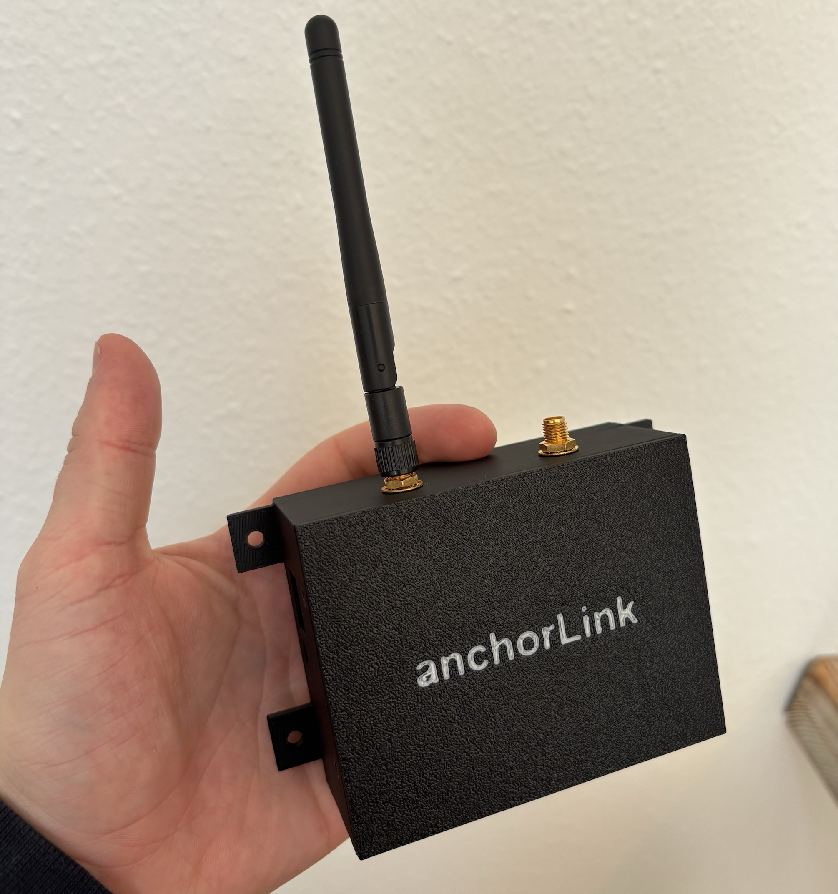

# Anchorlink

Cellular IoT firmware for a boat monitoring device, built on the **nRF9151**
(LTE-M/NB-IoT + GNSS) with **Zephyr RTOS** and the **nRF Connect SDK**.

The device sits on a boat and lets the owner control onboard relays, read
battery voltages, and arm a GNSS **anchor alarm** — all remotely over the
cellular network via MQTT. It runs on an [Onomondo](https://onomondo.com) SIM.

|  |  |
|:---:|:---:|
| The Anchorlink device | Main PCB |

## Features

- **Anchor alarm** — on command, the device acquires a GNSS fix, saves it as
  the anchor origin, and periodically re-checks its position. If it drifts
  beyond the configured radius (haversine great-circle distance), it publishes
  an alarm with the current position.
- **Remote relay control** — two relays, toggled from the cloud or physical
  buttons. State is published as retained MQTT messages and persisted to flash
  (NVS), so it survives reboots and reconnects.
- **Battery monitoring** — two battery banks sampled via ADC, reported on
  demand (the cloud polls; the device stays quiet otherwise to save power and
  data).
- **MQTT over TLS** — raw Zephyr MQTT client against a HiveMQ Cloud broker,
  with Last Will and Testament for online/offline presence, retained state
  topics, and JSON command parsing. The full protocol is specified in
  [mqtt.md](mqtt.md).
- **FOTA** — over-the-air updates via Memfault + MCUboot dual-slot images,
  triggered remotely with an MQTT command. Memfault also collects coredumps
  and LTE metrics for post-mortem debugging.
- **Robustness** — hardware watchdog reboots the device if the broker is
  unreachable for too long or a thread hangs; a fatal-error channel funnels
  unrecoverable errors into a controlled reboot.

## Architecture

The application is event-driven: independent modules communicate over
**zbus** message channels instead of calling each other directly, so each
module can be reasoned about (and replaced) in isolation.

```
 buttons ──┐                        ┌── network  (LTE link, connection manager)
 relays  ──┤                        ├── transport (MQTT client, SMF state machine)
 battery ──┼── zbus channels ───────┼── fota      (MCUboot image download)
 gps     ──┤   (CMD / PUBLISH /     ├── led
 sense   ──┘    NETWORK / ERROR)    └── watchdog
```

- The **transport** module wraps the MQTT client in a state machine built on
  Zephyr's State Machine Framework (SMF), handling connect/disconnect,
  re-subscription, and re-publishing retained state on every reconnect.
- The **network** module tracks LTE link state via Zephyr's connection
  manager and broadcasts connectivity changes to the rest of the system.
- Inbound MQTT commands are parsed as JSON and republished on an internal
  command channel — the module that owns the hardware acts on them.
- The firmware runs as the **non-secure** image under TF-M (Trusted
  Firmware-M), with MCUboot as the secure bootloader. TLS credentials are
  stored in the modem's key store, not in application flash.

## Repository layout

| Path | Contents |
|------|----------|
| [project/app/](project/app/) | Application: `src/` (device logic) and `src/modules/` (network, transport, FOTA, watchdog, …) |
| [project/boards/makerdiary/nrf9151_connectkit/](project/boards/makerdiary/nrf9151_connectkit/) | Custom Zephyr board definition (device tree + Kconfig) for the Makerdiary nRF9151 Connect Kit |
| [project/drivers/led/](project/drivers/led/) | Out-of-tree Zephyr driver for the TI LP5817 LED controller, with its own [device tree binding](project/dts/bindings/led/ti,lp5817.yaml) |
| [project/west.yml](project/west.yml) | West manifest pinning the nRF Connect SDK version |
| [mqtt.md](mqtt.md) | MQTT protocol specification: topics, payloads, QoS/retain policy, sequence diagrams |
| [scripts/](scripts/) | Release tooling and traffic-capture services (see below) |
| [justfile](justfile) | Build, flash, and debugging recipes |

## Building and flashing

Requires Python 3 and [just](https://github.com/casey/just). The Zephyr
toolchain and SDK are fetched by west into a local workspace.

```sh
just init      # create venv, west init/update, install dependencies
just build     # build for nrf9151_connectkit/nrf9151/ns (sysbuild: MCUboot + TF-M + app)
just flash     # full-chip erase + program merged.hex via pyocd
```

`just build -p` forces a pristine build. Board, build type, and build
directory are overridable via environment variables (see the justfile).

## Debugging and field tooling

Working over a live cellular network means most debugging happens at the
traffic level:

- **SIM traffic capture** — [scripts/onomondo-capture.sh](scripts/onomondo-capture.sh)
  runs as a systemd service and uses `onomondo-live` to continuously capture
  the device's cellular traffic to daily-rotated pcap files, so any
  connectivity issue can be inspected packet-by-packet in Wireshark.
- **MQTT traffic log** — [scripts/mqtt-capture.sh](scripts/mqtt-capture.sh)
  mirrors the same pattern on the broker side, logging every message with
  timestamps for correlation against the pcaps.
- **On-device shell** — Zephyr shell over UART with runtime log filtering.
- **Memfault** — coredumps, reboot reasons, and modem/LTE metrics from
  devices in the field; releases are cut with `just release`.
- **MQTT test recipes** — `just mqtt-sub`, `just mqtt-bat`, and
  `just mqtt-fota-update` exercise the device end-to-end from a laptop,
  including a scripted check that a FOTA request is acknowledged.

## Hardware

- [Makerdiary nRF9151 Connect Kit](https://makerdiary.com/products/nrf9151-connectkit)
  (custom board definition in this repo); an overlay for the Nordic nRF9151 DK
  is also provided.
- Two relays, two battery-sense ADC inputs, three buttons, and an LP5817
  RGB LED.
